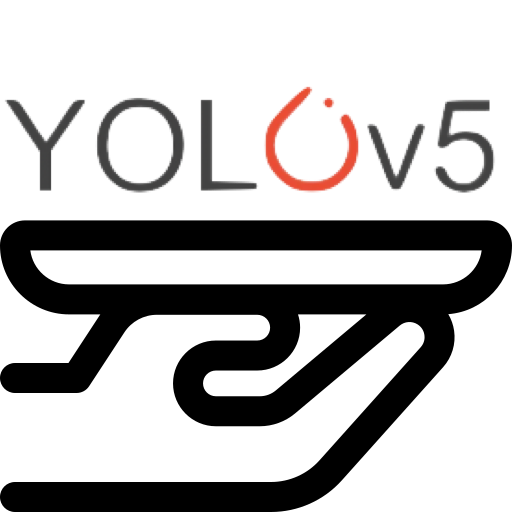

<!-- Improved compatibility of back to top link: See: https://github.com/othneildrew/Best-README-Template/pull/73 -->
<a name="readme-top"></a>
<!--
*** Thanks for checking out the Best-README-Template. If you have a suggestion
*** that would make this better, please fork the repo and create a pull request
*** or simply open an issue with the tag "enhancement".
*** Don't forget to give the project a star!
*** Thanks again! Now go create something AMAZING! :D
-->


<!-- PROJECT SHIELDS -->
<!--
*** I'm using markdown "reference style" links for readability.
*** Reference links are enclosed in brackets [ ] instead of parentheses ( ).
*** See the bottom of this document for the declaration of the reference variables
*** for contributors-url, forks-url, etc. This is an optional, concise syntax you may use.
*** https://www.markdownguide.org/basic-syntax/#reference-style-links
-->
[![Contributors][contributors-shield]][contributors-url]
[![Forks][forks-shield]][forks-url]
[![Stargazers][stars-shield]][stars-url]
[![Issues][issues-shield]][issues-url]
[![MIT License][license-shield]][license-url]
[![LinkedIn][linkedin-shield]][linkedin-url]


<!-- PROJECT LOGO -->
<br />
<div align="center">
  <a href="https://github.com/ben-omji/serve_yolov5">
    
  </a>

<h3 align="center">Serve YOLOv5</h3>

  <p align="center">
    Deploy YOLOv5 model in TorchServe environment
    <br />
    <a href="https://github.com/ben-omji/serve_yolov5"><strong>Explore the docs »</strong></a>
    <br />
    <br />
    <a href="https://github.com/ben-omji/serve_yolov5">View Demo</a>
    ·
    <a href="https://github.com/ben-omji/serve_yolov5/issues">Report Bug</a>
    ·
    <a href="https://github.com/ben-omji/serve_yolov5/issues">Request Feature</a>
  </p>
</div>


<!-- TABLE OF CONTENTS -->
<details>
  <summary>Table of Contents</summary>
  <ol>
    <li>
      <a href="#about-the-project">About The Project</a>
      <ul>
        <li><a href="#built-with">Built With</a></li>
      </ul>
    </li>
    <li>
      <a href="#getting-started">Getting Started</a>
      <ul>
        <li><a href="#prerequisites">Prerequisites</a></li>
        <li><a href="#installation">Installation</a></li>
      </ul>
    </li>
    <li><a href="#usage">Usage</a></li>
    <li><a href="#roadmap">Roadmap</a></li>
    <li><a href="#contributing">Contributing</a></li>
    <li><a href="#license">License</a></li>
    <li><a href="#contact">Contact</a></li>
    <li><a href="#acknowledgments">Acknowledgments</a></li>
  </ol>
</details>


<!-- ABOUT THE PROJECT -->
## About The Project

[![Product Name Screen Shot][product-screenshot]](https://github.com/ben-omji/serve_yolov5/images/screenshot.png)

<p align="right">(<a href="#readme-top">back to top</a>)</p>


### Built With

* [![Next][Docker]][Docker-url]

<p align="right">(<a href="#readme-top">back to top</a>)</p>


<!-- GETTING STARTED -->
## Getting Started

Here is an instructions on setting up this project locally.
To get a local copy up and running follow these simple example steps.

### Prerequisites

Before proceeding, you MUST install things listed below.
* [Docker](https://docs.docker.com/engine/install/)
* [Nvidia-container-toolkit](https://github.com/NVIDIA/nvidia-container-toolkit)

### Quickstart

1. Clone the repo
   ```sh
   git clone https://github.com/ben-omji/serve_yolov5.git
   ```
2. Setup
   ```sh
   cd serve_yolov5

   # Object detection
   ./setup.sh box

   # Object segmentation
   ./setup.sh seg

   # Check generated model archive
   ls ./resources/model-store/
   ```
3. Run
   ```sh
   # Object detection
   ./run_ts.sh coco_yolov5s.mar

   docker logs $(docker ps -lq)

   # !WARNING! >> If you want to run both models simultaneously, YOU MUST CHANGE THE PORT IN SCRIPT for preventing the conflict.

   # Object segmentation
   ./run_ts.sh coco_yolov5s-seg.mar


   docker logs $(docker ps -lq)
   ```
3. Test
   ```sh
   # Object detection
   curl -T PATH/TO/TEST/IMAGE 127.0.0.1:9080/predictions/coco_yolov5s

   # Object segmentation
   curl -T PATH/TO/TEST/IMAGE 127.0.0.1:9080/predictions/coco_yolov5s-seg
   ```

<p align="right">(<a href="#readme-top">back to top</a>)</p>


<!-- USAGE EXAMPLES -->
## Usage

TODO: Add instruction to deploy our own yolov5 model which is trained on custom datatset.

<p align="right">(<a href="#readme-top">back to top</a>)</p>


<!-- ROADMAP -->
## Roadmap

- [ ] gRPC client
    - [ ] python

See the [open issues](https://github.com/ben-omji/serve_yolov5/issues) for a full list of proposed features (and known issues).

<p align="right">(<a href="#readme-top">back to top</a>)</p>


<!-- CONTRIBUTING -->
## Contributing

Contributions are what make the open source community such an amazing place to learn, inspire, and create. Any contributions you make are **greatly appreciated**.

If you have a suggestion that would make this better, please fork the repo and create a pull request. You can also simply open an issue with the tag "enhancement".
Don't forget to give the project a star! Thanks again!

1. Fork the Project
2. Create your Feature Branch (`git checkout -b feature/AmazingFeature`)
3. Commit your Changes (`git commit -m 'Add some AmazingFeature'`)
4. Push to the Branch (`git push origin feature/AmazingFeature`)
5. Open a Pull Request

<p align="right">(<a href="#readme-top">back to top</a>)</p>


<!-- LICENSE -->
## License

Distributed under the Apache License, Version 2.0. See `LICENSE` for more information.

<p align="right">(<a href="#readme-top">back to top</a>)</p>


<!-- ACKNOWLEDGMENTS -->
## Acknowledgments

* [YOLOv5](https://github.com/ultralytics/yolov5)
* [TorchServe](https://github.com/pytorch/serve)

<p align="right">(<a href="#readme-top">back to top</a>)</p>


<!-- MARKDOWN LINKS & IMAGES -->
<!-- https://www.markdownguide.org/basic-syntax/#reference-style-links -->
[contributors-shield]: https://img.shields.io/github/contributors/ben-omji/serve_yolov5.svg?style=for-the-badge
[contributors-url]: https://github.com/ben-omji/serve_yolov5/graphs/contributors
[forks-shield]: https://img.shields.io/github/forks/ben-omji/serve_yolov5.svg?style=for-the-badge
[forks-url]: https://github.com/ben-omji/serve_yolov5/network/members
[stars-shield]: https://img.shields.io/github/stars/ben-omji/serve_yolov5.svg?style=for-the-badge
[stars-url]: https://github.com/ben-omji/serve_yolov5/stargazers
[issues-shield]: https://img.shields.io/github/issues/ben-omji/serve_yolov5.svg?style=for-the-badge
[issues-url]: https://github.com/ben-omji/serve_yolov5/issues
[license-shield]: https://img.shields.io/github/license/ben-omji/serve_yolov5.svg?style=for-the-badge
[license-url]: https://github.com/ben-omji/serve_yolov5/blob/master/LICENSE.txt
[linkedin-shield]: https://img.shields.io/badge/-LinkedIn-black.svg?style=for-the-badge&logo=linkedin&colorB=555
[linkedin-url]: https://linkedin.com/in/beomjin-kim-368203143
[product-screenshot]: images/screenshot.png
[Docker]: https://img.shields.io/badge/docker-0db7ed?style=for-the-badge&logo=docker&logoColor=white
[Docker-url]: https://www.docker.com/
[React.js]: https://img.shields.io/badge/React-20232A?style=for-the-badge&logo=react&logoColor=61DAFB
[React-url]: https://reactjs.org/
[Vue.js]: https://img.shields.io/badge/Vue.js-35495E?style=for-the-badge&logo=vuedotjs&logoColor=4FC08D
[Vue-url]: https://vuejs.org/
[Angular.io]: https://img.shields.io/badge/Angular-DD0031?style=for-the-badge&logo=angular&logoColor=white
[Angular-url]: https://angular.io/
[Svelte.dev]: https://img.shields.io/badge/Svelte-4A4A55?style=for-the-badge&logo=svelte&logoColor=FF3E00
[Svelte-url]: https://svelte.dev/
[Laravel.com]: https://img.shields.io/badge/Laravel-FF2D20?style=for-the-badge&logo=laravel&logoColor=white
[Laravel-url]: https://laravel.com
[Bootstrap.com]: https://img.shields.io/badge/Bootstrap-563D7C?style=for-the-badge&logo=bootstrap&logoColor=white
[Bootstrap-url]: https://getbootstrap.com
[JQuery.com]: https://img.shields.io/badge/jQuery-0769AD?style=for-the-badge&logo=jquery&logoColor=white
[JQuery-url]: https://jquery.com 